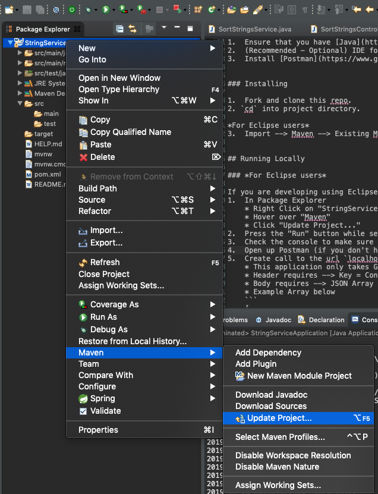

# String Service

This is an implementation of a REST server using Spring Boot that implements an interface with the requirement to take in a collection of strings and return that same collection after being sorted alphanumerically (Naturally sorted). 

## Getting Started

These instructions will get you a copy of the project up and running on your local machine for development and testing purposes. 

### Prerequisites

1.  Ensure that you have [Java](https://www.oracle.com/technetwork/java/javase/overview/java8-2100321.html) version 8 or greater. Check your java version with this command `java -version`. (I am running version 13)  
2.  (Recommended - Optional) IDE for java applications (Eclipse, IntelliJ, etc)  
3.  Install [Postman](https://www.getpostman.com/) to test API endpoints  


### Installing

1.  Fork and clone this repo.
2. `cd` into project directory.

*For Eclipse users*  
3.  Import --> Maven --> Existing Maven Projects --> Browse --> *Go to Directory (StringService)* --> Finish


## Running Locally

### *For Eclipse users*

If you are developing using Eclipse as your IDE, you can run the program and test the server with the following commands:
1.  In Package Explorer
	* Right Click on "StringService"
	* Hover over "Maven"
	* Click "Update Project..."  
	
2.  Press the "Run" button while selecting the following class --> "StringServiceApplication"
3.  Check the console to make sure you see the Spring Application Output
4.  Open up Postman (if you don't have Postman, open up tool to target API)
5.  Create call to the url `localhost:8080/sort`
	* This application only takes GET & POST calls
	* Header requires --> Key = Content type, Value = application/json
	* Body requires --> JSON Array of Strings ONLY
	* Example Array below
	```
	[
	    "1123",
	    "a",
	    "a1",
	    "a11",
	    "a2",
	    "a22",
	    "a3",
	    "aaa1",
	    "ab",
	    "ab3",
	    "asdff",
	    "b2",
	    "cheese",
	    "hello",
	    "za2",
	    "zzzShould be last"
	 ]
    
	```
6.  After calls are prepared with the previous requirements in Postman, send the call.
7.  Finished. You will be returned the sorted list.

### *For Command line users*

If you are developing using the command line and not using an IDE, you can run the program and test the server by following these steps:
1.  Navigate into project directory
2.  To run server use the command

```
./mvnw spring-boot:run
```
3.  Open up Postman (if you don't have Postman, open up tool to target API)
4.  Create call to the url `localhost:8080/sort`
	* This application only takes GET & POST calls
	* Header requires --> Key = Content type, Value = application/json
	* Body requires --> JSON Array of Strings ONLY
	* Example Array below
	```
	[
	    "1123",
	    "a",
	    "a1",
	    "a11",
	    "a2",
	    "a22",
	    "a3",
	    "aaa1",
	    "ab",
	    "ab3",
	    "asdff",
	    "b2",
	    "cheese",
	    "hello",
	    "za2",
	    "zzzShould be last"
	 ]
    
5.  After calls are prepared with the previous requirements in Postman, send the call.
6.  Finished. You will be returned the sorted list.


## Built With 

* [Spring Boot](https://spring.io/projects/spring-boot/) - The Java framework used
* [Maven](https://maven.apache.org/) - Dependency Management

## My Environment

* Device: 2019 Macbook Pro  
* OS: macOS Mojave 10.14.6  
* [Java](https://www.oracle.com/technetwork/java/javase/downloads/jdk13-downloads-5672538.html) SE Development Kit 13  
* IDE: [Eclipse](https://www.eclipse.org/downloads/packages/) - IDE used - Version: 2019-09 R (4.13.0)  
* Spring Boot - Version 2.1.8 w/ Maven2  
* [Postman](https://www.getpostman.com/) - Platform that was used for API development - Version 7.8.0  


## Author

* **Conor Cook** 

## Acknowledgments
